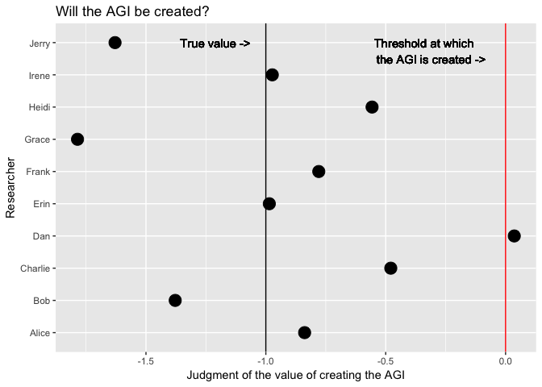
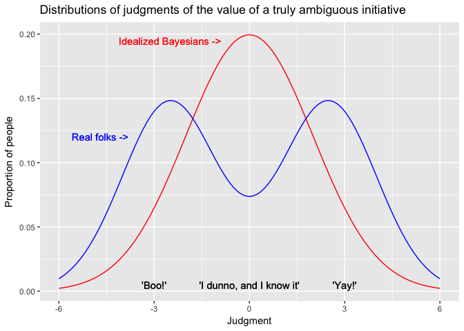

Imagine it's the year 2070, and among the thousands of computer scientists in the world, there are now ten who have independently figured out how to create an artificial general intelligence (AGI). None of them have gone ahead with it yet. They're all trying to ascertain whether such a development would be good or bad for humanity.

Each of these ten researchers is familiar with the intricate difficulties of the [control problem](https://en.wikipedia.org/wiki/AI_control_problem), and each of them believes they may have made enough headway on it that the AGI could be created safely. But none of them are 100% certain that their specifications are perfect. So they must all weigh the potential consequences of a) creating a misalligned AGI, or b) delaying their own best attempt at an alligned AGI, with the risk that someone else will try first but fail catastrophically.

Let's say none of them have quite solved the control problem, and thus if any one of them goes through with the initiative, the consequences will be harmful. Crowds are smart, and the *average* judgment of the value of creating the AGI will probably be more accurate than the judgments of most individuals. But there is some variance in these judgments, and if the variance is large enough, there may be one or two researchers who incorrectly decide to proceed with their creation.

This is an example the *unilateralist's curse*, a phenomemon described in a [2016 paper](http://dx.doi.org/10.1080/02691728.2015.1108373) by Nick Bostrom, Thomas Douglas, and Anders Sandberg. The curse occurs when...

-   There is a group of altruistic decision-makers.
-   Each of them must independently decide whether to undertake a given initiative.
-   The value of the initiative is ambiguous; that is, there is some variance in people's judgments of the initiative's value.
-   The true value of the initiative is negative.

The curse is that the average judgment of the value of the initiative doesn't determine whether the initiative will be undertaken; instead, the *maximally positive* judgment does. All that is required for the initiative to be undertaken is for a single agent to decide that it would do some good. And there are three potential conditions that could lead to this:

-   The variance of the judgments is especially high, causing some agents to make positive judgments regardless of the true value or the average judgment thereof.
-   The average judgment is especially close to zero (i.e. neutral — the initiative does neither harm nor good).
-   There are especially many agents making the judgment of whether or not to undertake the initiative, causing the tails of the distribution to be filled out.

To mitigate the unilateralist's curse, the authors propose a Principle of Conformity, which urges unilateral decision-makers to defer to the majority opinion about the value of an initiative. In other words, if you're the only person who thinks something is a good (or bad) idea, there's a good chance you're wrong.

The proposed model for the unilateralist's curse is reasonable for perfect Bayesian agents, and perhaps for certain types of group-level agents. But for humans, it makes assumptions that don't always hold. For example, I expect that on many issues, human judgment of the value of a given initiative would be bimodal, not Gaussian. It's much more natural and much more common to define oneself as decidedly for or against a proposal than to successfully ascertain one's uncertainty.

Moreover, these judgments are likely to be determined less by the true value of the initiative than by heuristics and biases, many of which will favour either conformity or contrarianism to begin with. So, a principle of conformity may simply amplify existing group-level bias. It may also punish people who would rightly defy an erroneous crowd, as most revolutionary scientists have done.

Still, there is a crucial insight at the core of the unilateralist's curse and the principle of conformity: if you can manage to conceptualize each of your beliefs as but a single instantiation of a randomly distributed collection of beliefs centered around the truth, you might find reason to shift that belief, if only slightly, toward the conformist view. Beyond that, just make sure to choose the right crowd.