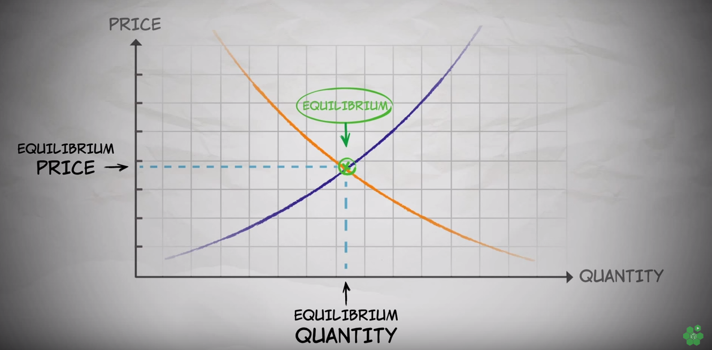

The first lesson in economics is that in a free market, the price of a good tends to settle where the supply curve meets the demand curve:

*Image source: [Marginal Revolution University: The Equlibrium Price](http://bit.ly/1Um2DJ7)*

If the price is too high, suppliers have more of the product than buyers want, so the price decreases as suppliers compete with each other to make the sale. If the price is too low, buyers want more of the product than the suppliers have, so the price increases as buyers compete with each other to win the auction.

You might wonder: why is it that in some markets, there are multiple prices for a single product? For example, why do airlines divide plane seats into business class and economy? If the market truly set the price, you'd expect the airline to charge the same price to everyone.

The answer is that buyers and sellers don't know the same information. In this case, the airline (the seller) doesn't know how highly a given passenger (the buyer) values her money. It may be that Alice would pay \$100 at most for a ticket, and Bob would pay as much as \$200. If the airline only sells tickets at \$100 apiece, then Bob will pay less than he could otherwise afford. And if the airline only sells tickets at \$200 apiece, Alice won't buy a ticket at all.

One solution is to present a menu of options, thereby causing buyers to reveal information about their values when they make their choice. Alice buys economy class, Bob buys business class, and the airline profits maximally from both of them.

By presenting a menu of options, the airline is trying to solve the problem of *information asymmetry*, which was first described in 1970 in George Akerlof's landmark [paper](http://www.jstor.org/stable/1879431), "The Market for "Lemons": Quality Uncertainty and the Market Mechanism." (It was also described in a recent [Economist article](http://www.economist.com/news/economics-brief/21702428-george-akerlofs-1970-paper-market-lemons-foundation-stone-information), which was how I learned about it.) Akerlof showed that when buyers and sellers don't know the same information, the market shrinks.

To illustrate this phenomenon, Akerlof presents an example of a used-car market. Some cars are "lemons" – low-quality cars worth \$500 – and some cars are "peaches" – high-quality cars worth \$1,000.

Imagine you're a buyer who wants a peach, but you can't tell the peaches from the lemons. How much should you offer? You wouldn't offer \$1,000 for a car if you thought there was a 50% chance it's a lemon. You'd offer the average of the two prices, \$750, to account for the risk of being ripped off.

But now you realize: the seller wouldn't sell a peach for only \$750 – it's worth more than that! In fact, as long as you're offering less than \$1,000, the seller will only ever sell you a lemon, because that's the only way to profit. So your final offer is $500, and you drive away in a lemon. In fact, if all buyers are as wily as you, *everyone* drives away in a lemon. The peaches never leave the lot; the market has been ruined by information asymmetry.

Now, Akerlof's example is pretty unrealistic. (He knew this.) Firstly, it's pretty hard to achieve *complete* information asymmetry. Cars don't all look the same, and a buyer doesn't have to be an expert to know that a car with no steering wheel is probably a lemon. Secondly, real used-car lots don't have only lemons and peaches. Real cars' values are on a spectrum.

I decided to tinker with these assumptions to see how they affect market shrinkage. I simulated nine different formulations of the market for lemons, varying along two dimensions. The first dimension is the amount of information asymmetry, which ranges from "none" to "partial" to "complete". The second dimension is the plausibility of the distribution of cars' values. I considered the original dual market, in which half the cars are peaches and half are lemons, to be the least plausible. More plausible is a uniform distribution, and more plausible still is a normal distribution.

In the chart below, I show the scaled market values under each simulation.

The red bars show the market values when there is no information asymmetry, and all trades occur. The green bars show the market values when there is complete information asymmetry, and only half of all trades occur (the ones where the cars' values are below average). Lastly, the blue bars show the market values when there is partial information asymmetry, and many below-average trades occur and few above-average trades occur.

From these simulations, it's clear that no matter what the distribution of goods, even partial information asymmetry can ruin the market. Not only is the total market value reduced, but it's actively negated; there are so many high-value goods that go to waste that the participants in the market would have been better off if no cars had been supplied in the first place.

The only condition where the market value was reduced but not negated was when the goods were normally distributed and the information asymmetry was partial. However, this condition is especially dependent on the simulation parameters, which I personally chose according to my own judgment. And I am not an economist.

I'm tempted to say that my simulations have shown that real-world information asymmetry isn't as destructive as Akerlof's example would have us believe. But the best-case result is a 96% shrinkage, so I can't offer much consolation by way of the math.

However, there is one last false assumption that all of these models are making. The assumption is that buyers and sellers in the real world are perfectly rational and perfectly self-interested. Traditional economics assumed this for centuries until the late 20th century, when the psychologists Daniel Kahneman and Amos Tversky [showed that it was false](https://en.wikipedia.org/wiki/Behavioral_economics).

People aren't perfectly rational: they don't go around maximizing expected utility (i.e. value * probability) whenever they have to make a decision under uncertainty. Instead, they use heuristics – rules of thumb – most of which are better suited to evading tigers than to navigating a modern economic environment. 

People aren't perfectly self-interested: they don't go around exploiting each other at every opportunity. They feel empathy; they feel shame; they trust when they can; they retaliate when they must.

With these facts in mind, a different model of trading comes into view: trading could take place despite information asymmetry if buyers were perfectly trustworthy and sellers were perfectly honest. Fanciful as this may seem, it adds another dimension to the problem and another route to a solution. 

## Methodological appendix

### Computing the market value

To compute what I call the market value, I use the sum of the values of all cars sold, minus the sum of the values of all cars not sold:

$$\text{Market value} = \sum_{0}^{n}s_i - \sum_{0}^{m}k_j$$

where \$\$ s_i $$ is the value of a car that sold, and $k_j$ is the value of a car that did not sell (i.e. was "kept").

When there is no information asymmetry, every car is sold, so,

$$\sum_{0}^{m}k_j = 0$$

This is a special case in which the market value is maximized. Now, I'm interested in how different assumptions affect market *shrinkage*, but I don't care so much about the *absolute* value of a given market, which depends on factors other than information asymmetry.

So, for each market distribution, I scale the market value by dividing it by the maximum market value, i.e.,

$$\text{Scaled market value} = \frac{\sum_{0}^{n}s_i - \sum_{0}^{m}k_j}{\sum_{0}^{n}s_i}$$

### Computing buyers' offers

To determine whether a given car would sell, I had to compute its respective buyer's offer, and compare it to the true value of the car. If the offer was equal to or greater than the true value, the car would sell.

In Akerlof's paper, buyers' offers were computed using expected utility:

$$\text{offer} = \frac{\sum_0^m p_i v_i}{m}$$

where $p_i$ is the probability of getting car $i$, and $v_i$ is the value of car $i$.

This assumes that the buyers know the probabilities and values of each car in the market, even if they can't tell which cars are which. I use the same assumption in my model of markets with complete information asymmetry.

I formulate partial asymmetry somewhat differently. I assume that buyers know the mean value of the cars, and that they use this as a prior probability for determining the optimal offer of a given car, once they've seen it.

However, I didn't use an explicit Bayesian model for how the buyer would update on her prior after seeing the car. The reason for this was that unless the evidence the buyer sees causes her to update *beyond* the true value of the car, then overall effect on the market would still be that only cars below the mean value would sell. For example, if a car is worth \$900, the buyer would need to shift her prior of \$750 upwards by a full \$150 in order for the car to sell. For this to occur, the buyer would have to see not only strong evidence, but *false* evidence of the value of the car. I couldn't think of a simple way to operationalize this possibility, so I ignored it.

Instead, I build in some straight-up randomness so that all cars would have some chance of selling, even if they were above the mean value. So, for each of my models with partial asymmetry, the buyer's offer is drawn from a normal random variable located at the midpoint between the overall average value and the true value of the car in question. The standard deviation of the random variable is half the interval between the overall average value and the true value:

$$X \sim \mathcal{N}(r+(\frac{t-r}{2}), |\frac{t-r}{2}|^{2}))$$

where $t$ is the true value of the car, and $r$ is the overall average value, which is used as the "prior."

So, there is a 68% chance that the buyer's offer will be between the overall average and the true value of the car in question, and there is a 16% chance that the offer will be more extreme than the true value (whether the true value is more or less than the average). Note that this randomization affects both high-value *and* low-value cars; it is thus possible that even a lemon will fail to sell, just as it is now possible that a peach will successfully sell.

If you'd like to play with the simulations, I invite you to check out my code on [GitHub](https://github.com/laingdk/lemons).