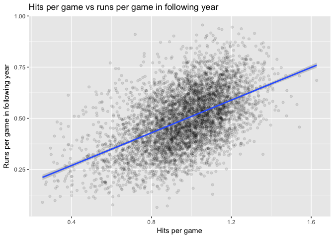
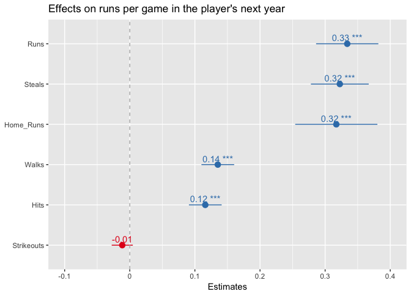
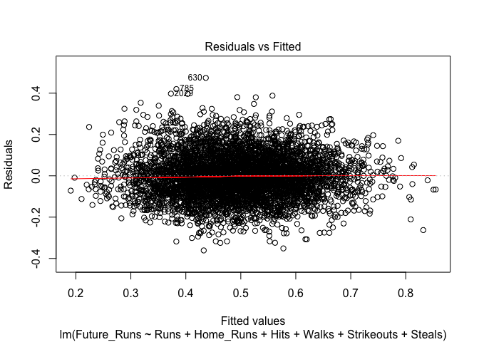
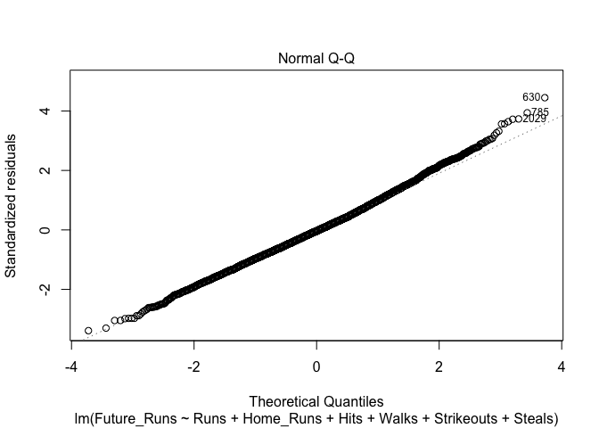
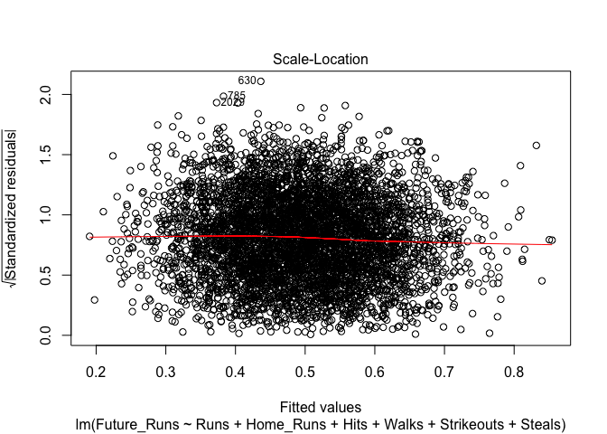
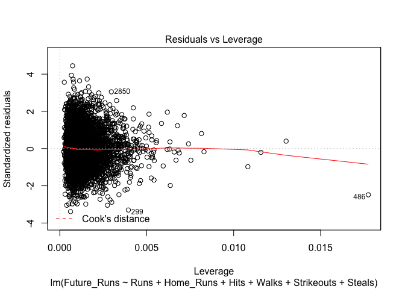

Executive summary
-----------------

The more runs a baseball team scores, the more money it earns. Managers and scouts, therefore, should highly value players who show promise of scoring many runs. Six predictors of future runs were analysed, and five were found to predict a higher number of future runs per game. Three had large effects: runs per game, stolen bases per game, and home runs per game. Two had smaller but still significant effects: hits per game and walks per game. Striking the right balance among these variables will lead to sound investments.

Introduction
------------

From a management perspective, while it is nice to a have baseball team that wins games, it is even nicer to have one that makes money. Market research has shown that the best predictor of high revenue is not whether a team tends to win games, but how many runs it tends to score (Timbers and Kroc 2017). This implies that to build a high-earning team, scouts should look for players who are likely to score as many runs as possible, even if those players are weaker in other aspects of the game.

It is a difficult analytical task to determine how many runs a given player is likely to score. Whether or not a player touches home base could depend on countless factors, such as the player's batting skills, the player's running speed, the player's judgment in whether to attempt a steal, the runner-up's batting skills, the pitcher's skills, the base-men's skills, whether it is a home or away game, whether the sun was in the player's eyes, how well the player slept the previous night, and so on.

Luckily, there are ample statistics available. In this report, I describe my analysis of the Sean Lahman Baseball Database to identify factors that are predictive of high scoring. The results of my analysis will help scouts and managers to make informed decisions about which players to sign and retain.

Methodology
-----------

Doing statistical analysis is like having a conversation with a dataset. If the dataset is to provide useful answers to our questions, it is vital that we be specific in the asking. On first blush, it may seem that we should ask the following: for a given player in a given year, which factors are associated with scoring a high number of runs?

However, if the goal is to use the available data to predict how many runs the player will score in the *future*, this question ignores the most important available statistic: the number of runs the player scored in the past. The question I asked was this: given the available information about a player's batting history, how many runs is he expected to score in the next season?

Having identified an appropriate question, the next challenge was to determine which parts of the dataset to pay attention to and which parts to ignore. The Lahman Batting dataset contains batting statistics for over 100,000 Major League Baseball players from 1871 to 2012. Here is a sample from the dataset:

|      | playerID  |  yearID|  stint| teamID | lgID |    G|   AB|    R|    H|  X2B|  X3B|   HR|  RBI|   SB|
|------|:----------|-------:|------:|:-------|:-----|----:|----:|----:|----:|----:|----:|----:|----:|----:|
| 1000 | thomaan01 |    1990|      1| ATL    | NL   |   84|  278|   26|   61|    8|    0|    5|   30|    2|
| 1001 | thomafr04 |    1990|      1| CHA    | AL   |   60|  191|   39|   63|   11|    3|    7|   31|    0|
| 1002 | thompmi02 |    1990|      1| SLN    | NL   |  135|  418|   42|   91|   14|    7|    6|   30|   25|
| 1003 | thompri01 |    1990|      1| MON    | NL   |    1|    0|    0|    0|    0|    0|    0|    0|    0|
| 1004 | thompro01 |    1990|      1| SFN    | NL   |  144|  498|   67|  122|   22|    3|   15|   56|   14|
| 1005 | thondi01  |    1990|      1| PHI    | NL   |  149|  552|   54|  141|   20|    4|    8|   48|   12|

Each row represents a specific player in a specific year. The full table has twenty columns, most of which are variables related to the player's batting performance. Examples of these variables are number of runs, number of hits, and number of walks. For a full description of the dataset and all the variables, see [here](http://lahman.r-forge.r-project.org/) (Friendly and Dalzell 2016).

Baseball changed significantly in the late 1980s, when steroid use became widespread (D’Addona 2011). Because of this important change in the game, I only analysed data from after 1990.

I also removed rows from the table in which the player played fewer than 100 games in that year. To understand this decision, consider the following example. If the player John Smith only plays two games in 2017, but he does not score a run in either of them, it is not necessarily sensible to predict that he will never score a run if we sign him for next year. But if he plays 100 games in 2017, and he still scores no runs, we can be more confident in our prediction. By selecting only the rows in which a player played more than 100 games, I removed much of the noise that results from small sample sizes. The edited dataset looks more like this:

| playerID  |  yearID|  Future\_Runs|       Runs|  Home\_Runs|       Hits|      Walks|  Strikeouts|     Steals|
|:----------|-------:|-------------:|----------:|-----------:|----------:|----------:|-----------:|----------:|
| counscr01 |    2005|     0.5333333|  0.5666667|   0.0600000|  0.9866667|  0.5200000|   0.4600000|  0.1733333|
| counscr01 |    2006|     0.2540984|  0.5333333|   0.0380952|  0.9047619|  0.2952381|   0.4476190|  0.1428571|
| counscr01 |    2007|     0.2818182|  0.2540984|   0.0245902|  0.5081967|  0.3360656|   0.3852459|  0.0327869|
| counscr01 |    2008|     0.4692308|  0.2818182|   0.0090909|  0.5090909|  0.4181818|   0.3818182|  0.0272727|
| counscr01 |    2009|     0.1568627|  0.4692308|   0.0307692|  0.8846154|  0.3230769|   0.4153846|  0.0230769|
| counscr01 |    2010|     0.1775701|  0.1568627|   0.0196078|  0.5000000|  0.2058824|   0.2843137|  0.0098039|

To determine which variables can be used to predict the number of future runs, I used a statistical technique called linear regression. Linear regression is used to understand the relationship between two or more variables, and to make predictions about one of those variables based on information about the others. Mathematically, linear regression works by fitting a line through the data:



The line can be described by an equation in the form *y* = *m**x* + *b*, where *y* is the dependent variable (the one we wish to predict), *x* is the independent variable (the one we already know), *b* is the y-intercept (the value of *y* when *x* = 0), and *m* is the slope of the line, which tells us how much of an increase in *y* should be expected for every unit increase in *x*. In the graph above, *m* would tell us how many more runs to expect for each added hit.

Although it cannot be visualized as easily as in the example above, linear regression can be used to fit lines through data that have more than just two dimensions. Each dimension gets its own *m* estimate, which can be understood in the same way as in the graph above: for each unit increase in the independent variable, we should expect an *m* increase in the dependent variable. My analysis ultimately used six independent variables (or 'predictors'), and I obtained estimates of each of their effects.

Because of the research goal to predict future runs, I had to manipulate the remaining dataset slightly. First, since some players in the dataset played for different teams in the same year, I combined those rows and summed up all the batting statistics so that I had at most one row per year per player. Next, I divided each batting statistic by the number of games played by that player in that year. This protects against making the mistake of thinking that, for example, the player John Smith, who scored 50 runs in 200 games, is just as good as the player Tom Jones, who scored 50 runs in 100 games. Lastly, I added a column to each row with the number of runs scored by that player in the *following* year that he appeared. I fit a linear regression to predict the number of hits in the following year based on six of the current year's batting statistics:

-   Runs per game
-   Home runs per game
-   Hits per game
-   Walks per game
-   Strikeouts per game
-   Stolen bases per game

Results
-------

The graph below shows the estimated effects of each variable on the predicted number of runs per game in the next year in which the player appeared.



If the variable is plotted in blue, there is a positive relationship between that variable and runs per game in the player's next year. If the variable is plotted in red, the relationship is negative. The decimal number accompanying each point corresponds to the predicted change in number of runs per game for every unit increase in each variable. For example, look at the variable at the top of the graph — runs per game. For every added run per game that a player scores in a given year, we should expect to see an extra 0.33 runs per game in the player's next year.

The horizontal lines emanating from each point are called confidence intervals. They represent the model's uncertainty about the estimated values of the effects. Each line represents a range of values in which the estimated value would be expected to fall 19 times out of 20, if we were to repeat the experiment many times. Longer lines correspond to greater uncertainty, because the true effect might be anywhere within that range. So, the variable with the effect that we are least confident in is home runs per game; our best guess is that the effect is 0.32 added runs in the player's next year for every added home run this year, but the effect might be as low as around 0.25 or as high as around 0.38.

Discussion
----------

Three batting statistics were shown to have strong positive relationships with future runs per game: runs per game, stolen bases per game, and home runs per game. Each of these has an effect in the range of roughly 0.28 to 0.36 added future runs per game for every unit increase in the predictor. These results are unintuitive: players who successfully steal bases are roughly as valuable as players who get runs and as players who get home runs, all else being equal.

Walks per game and hits per game also had positive relationships with future runs per game, but the effects were smaller — in the range of 0.10 to 0.15 added future runs per game for every unit increase in the predictor. These results suggest that players who get many walks and hits should be valued for the likelihood of scoring future runs, but less than players who get runs, steals, or home runs, all else being equal. Note that these results may also call into question a commonly used measure of offensive strength — the batting average. It appears that a player's likelihood of scoring runs is about more than just whether he can hit the ball.

Lastly, strikeouts per game was estimated to have a very slightly negative relationship with future runs per game. However, the confidence interval contains the value 0, which means that for all we know, strikeouts may not have any relationship with future runs per game. All else being equal, a player should not be valued more or less according to his number of strikeouts per game.

These conclusions must come with a few caveats. The most important one has already been mentioned: whether or not a player reaches home base depends on more than just the variables that can be captured in batting statistics. Secondly, these estimated effects are to be interpreted as descriptions of what might happen on average. There may still be high variation among individuals. Thirdly, I want to be clear that these estimates were formed by relating the batting statistics for a given year with the runs per game in the next year. They were not formed by relating all of the available historical data for each individual, at any given year, with the next year. When making scouting decisions, it will likely make more sense to consider all of the available historical data for the player in question. I did not do this because I was interested primarily in the relationships between the variables, and not in predicting as accurately as possible for every individual player.

Recommendations
---------------

Most importantly, look for players who score well on one or more of the following statistics:

-   Runs per game
-   Stolen bases per game
-   Home runs per game

To a lesser extent, look for players who get lots of hits or lots of walks, as long as this does not come at the cost of one or more of the above statistics.

Lastly, since other team managers may perceive players with high strikeout rates to be poorer investments, it may be possible to get good deals on these players, especially if they score well on runs, steals, or home runs.

Appendix
--------

See below for the flow of my analysis from start to finish.

``` r
# Get the Lahman Batting table.
Batting <- Lahman::Batting %>%
        # Filter out years before 1990.
        filter(yearID >= 1990) %>%
        # Group by player and year.
        group_by(playerID, yearID) %>%
        # Count batting statistics.
        summarize(G = sum(G),
                  AB = sum(AB),
                  R = sum(R),
                  H = sum(H),
                  X2B = sum(X2B),
                  X3B = sum(X3B),
                  HR = sum(HR),
                  RBI = sum(RBI),
                  SB = sum(SB),
                  CS = sum(CS),
                  BB = sum(BB),
                  SO = sum(SO),
                  IBB = sum(IBB),
                  HBP = sum(HBP),
                  SH = sum(SH),
                  SF = sum(SF),
                  GIDP = sum(GIDP)) %>% 
        # Filter out players/years with less than 100 games.
        filter(G >= 100) %>% 
        # Divide batting statistics by games.
        mutate(AB = AB / G,
               Runs = R / G,
               Hits = H / G,
               X2B = X2B / G,
               X3B = X3B / G,
               Home_Runs = HR / G,
               RBI = RBI / G,
               Steals = SB / G,
               CS = CS / G,
               Walks = BB / G,
               Strikeouts = SO / G,
               IBB = IBB / G,
               HBP = HBP / G,
               SH = SH / G,
               SF = SF / G,
               GIDP = GIDP / G, 
               Future_Runs = lead(R, 1) / lead(G, 1)) %>% 
        filter(!is.na(Future_Runs)) %>% 
        select(playerID, yearID, Future_Runs, Runs, Home_Runs, Hits, Walks, Strikeouts, Steals)

# Fit a linear model.
fit <- lm(Future_Runs ~ Runs + Home_Runs + Hits + Walks + Strikeouts + Steals, Batting)

# Plot the effects.
sjp.lm(fit,
       title = "Effects on runs per game in the player's next year")
```


``` r
# Summarize the model results.
summary(fit)
```

    ## 
    ## Call:
    ## lm(formula = Future_Runs ~ Runs + Home_Runs + Hits + Walks + 
    ##     Strikeouts + Steals, data = Batting)
    ## 
    ## Residuals:
    ##      Min       1Q   Median       3Q      Max 
    ## -0.36114 -0.07176 -0.00398  0.06684  0.47391 
    ## 
    ## Coefficients:
    ##              Estimate Std. Error t value Pr(>|t|)    
    ## (Intercept)  0.111968   0.009362  11.960   <2e-16 ***
    ## Runs         0.333930   0.024382  13.696   <2e-16 ***
    ## Home_Runs    0.317150   0.032191   9.852   <2e-16 ***
    ## Hits         0.115955   0.012817   9.047   <2e-16 ***
    ## Walks        0.135178   0.012814  10.549   <2e-16 ***
    ## Strikeouts  -0.011544   0.008270  -1.396    0.163    
    ## Steals       0.322552   0.022641  14.246   <2e-16 ***
    ## ---
    ## Signif. codes:  0 '***' 0.001 '**' 0.01 '*' 0.05 '.' 0.1 ' ' 1
    ## 
    ## Residual standard error: 0.1066 on 5095 degrees of freedom
    ## Multiple R-squared:  0.467,  Adjusted R-squared:  0.4664 
    ## F-statistic:   744 on 6 and 5095 DF,  p-value: < 2.2e-16

``` r
# Plot model diagnostics.
plot(fit)
```



``` r
# Show session info.
sessionInfo()
```

    ## R version 3.3.1 (2016-06-21)
    ## Platform: x86_64-apple-darwin13.4.0 (64-bit)
    ## Running under: OS X 10.12.3 (Sierra)
    ## 
    ## locale:
    ## [1] en_CA.UTF-8/en_CA.UTF-8/en_CA.UTF-8/C/en_CA.UTF-8/en_CA.UTF-8
    ## 
    ## attached base packages:
    ## [1] stats     graphics  grDevices utils     datasets  methods   base     
    ## 
    ## other attached packages:
    ##  [1] knitr_1.15.1    sjPlot_2.1.2    dplyr_0.5.0     purrr_0.2.2    
    ##  [5] readr_1.0.0     tidyr_0.6.1     tibble_1.2      ggplot2_2.2.1  
    ##  [9] tidyverse_1.0.0 Lahman_5.0-0   
    ## 
    ## loaded via a namespace (and not attached):
    ##  [1] stringdist_0.9.4.2 zoo_1.7-13         modeltools_0.2-21 
    ##  [4] coin_1.1-3         reshape2_1.4.2     splines_3.3.1     
    ##  [7] haven_1.0.0        lattice_0.20-33    colorspace_1.3-1  
    ## [10] htmltools_0.3.5    stats4_3.3.1       yaml_2.1.14       
    ## [13] survival_2.39-4    nloptr_1.0.4       foreign_0.8-66    
    ## [16] DBI_0.5-1          RColorBrewer_1.1-2 modelr_0.1.0      
    ## [19] multcomp_1.4-6     plyr_1.8.4         stringr_1.1.0     
    ## [22] effects_3.1-2      sjmisc_2.1.0       munsell_0.4.3     
    ## [25] gtable_0.2.0       mvtnorm_1.0-5      codetools_0.2-14  
    ## [28] psych_1.6.9        evaluate_0.10      labeling_0.3      
    ## [31] lmtest_0.9-34      parallel_3.3.1     highr_0.6         
    ## [34] broom_0.4.1        TH.data_1.0-7      Rcpp_0.12.9.2     
    ## [37] scales_0.4.1       backports_1.0.4    lme4_1.1-12       
    ## [40] mnormt_1.5-4       digest_0.6.12      stringi_1.1.2     
    ## [43] grid_3.3.1         rprojroot_1.1      tools_3.3.1       
    ## [46] sjstats_0.7.0      sandwich_2.3-4     magrittr_1.5      
    ## [49] lazyeval_0.2.0     MASS_7.3-45        Matrix_1.2-6      
    ## [52] assertthat_0.1     minqa_1.2.4        rmarkdown_1.2.9000
    ## [55] R6_2.1.3           nnet_7.3-12        nlme_3.1-128

References
----------

D’Addona, Dan. 2011. “Baseball’s Forgotten Era: The ’80s.” *Baseball Research Journal* 40 (2). Society for American Baseball Research. <http://sabr.org/research/baseball-s-forgotten-era-80s>.

Friendly, Murphy, Michael, and Chris Dalzell. 2016. “Sean Lahman Baseball Database.” R-Forge. <http://lahman.r-forge.r-project.org/>.

Timbers, Tiffany, and Ed Kroc. 2017. “Final Report.” UBC Master of Data Science Program. <https://github.ubc.ca/ubc-mds-2016/DSCI_542_comm-arg_students/blob/master/deliverables/report/report.md>.
