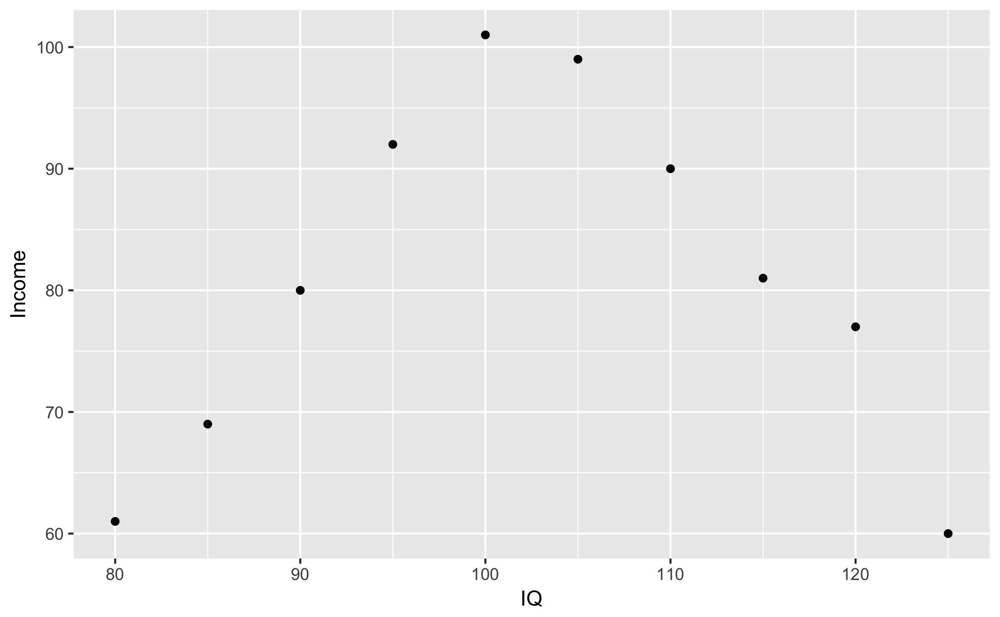
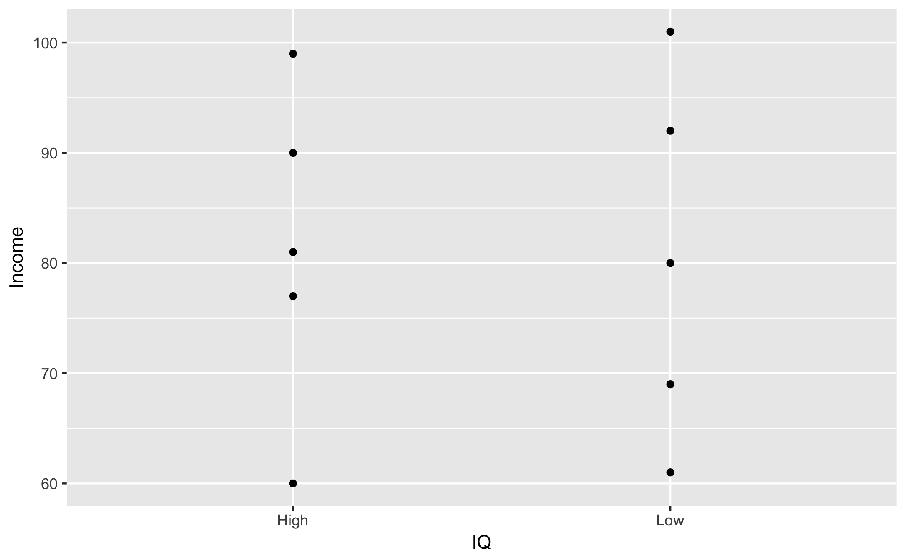

The main point of this post is to show how generalization and specification underpin many technical and social aspects of data science. I begin by explaining the basics of [information theory](https://en.wikipedia.org/wiki/Information_theory), and then I describe some implications for security and inference in the context of data disclosure.

__________________________________________

I am thinking of a letter in the Latin alphabet:

`A B C D E F G H I J K L M N O P Q R S T U V W X Y Z`

Say I want to tell you which letter I chose, but the only symbols I can use are `0` and `1` – binary code. Here's one way I could do it:

`0 0 0 1 0 0 0 0 0 0 0 0 0 0 0 0 0 0 0 0 0 0 0 0 0 0`

As long as we both agree on the order of the alphabet, this sequence of digits gets the message across. But it's wildly inefficient. If I wanted to send you a message, I would require twenty-six characters for every letter. I would need 130 characters just to say "hello." Luckily, there is a more efficient way to translate an alphabet to binary. See if you can figure it out from the examples below:

Here is the letter `A`: `1 1 1 1 1`

And here is the letter `Z`: `0 0 0 0`

Here is the letter `M`: `1 0 0 0`

And the letter `N`: `0 1 1 1 1`

And the letter `D`: `1 1 1 0 0`

When your head is sufficiently scratched, scroll on down for the good stuff.

__________________________________________

↓↓↓

↓↓↓

↓↓↓

↓↓↓

↓↓↓

( ﾟ▽ﾟ)/

↓↓↓

↓↓↓

↓↓↓

↓↓↓

↓↓↓

↓↓↓

__________________________________________

The problem of communication is the problem of moving from the *general* to the *specific*. It is the problem of transforming a state of knowledge in which *anything could be true* to a state of knowledge in which *only one thing could be true*.

Let's say I want to send the letter `K`. In our alphabet example, you begin by not knowing anything about which letter I have in mind – it could be any of the twenty-six. But then I send you the first digit:

`1`

This means that the letter is in the first half of the alphabet. I have just helped your state of knowledge go from general...

`A B C D E F G H I J K L M N O P Q R S T U V W X Y Z`

...to more specific:

`A B C D E F G H I J K L M`

This act of cutting a hypothesis space in two is the power of a single *bit* – the fundamental unit of information. Information literally cannot come in a smaller packet than a `yes` or a `no` in the `yes/no` menu of symbols.

Now I send you the second digit:

`0`

This means that the letter is in the second half of the remaining alphabet. (At this point we had an odd number of remaining symbols, so the middle symbol counts as being in the first half.)

Again, we've gone from general...

`A B C D E F G H I J K L M`

...to more specific:

`H I J K L M`

Now I send the third digit:

`0`

And we are down to...

`K L M`

Fourth digit:

`1`

And we're down to...

`K L`

Fifth and final digit:

`1`

And we have our letter:

`K = 1 0 0 1 1`

So it costs one bit to cut a hypothesis space in two; it costs two bits to cut a hypothesis space in four; it costs three bits to cut a hypothesis space in eight; and so on. A pattern! The number of bits that are required to identify a single symbol in an alphabet of *n* symbols is...

$$\log_2(n)$$

And that's information theory, the beating heart of the digital world.

As a data science student, I am learning to specialize in bits. I am learning to navigate the generality and specificity of data in order to understand how things work, at whichever level matters most. For example, say I'm considering the following dataset:

| ID  | IQ  | Income |
|----:|----:|-------:|
| 1   | 104 | 67,265 |
| 2   | 95  | 71,662 |
| 3   | 105 | 83,744 |
| 4   | 110 | 55,781 |
| 5   | 100 | 83,640 |
| 6   | ?   | ?      |

When I do *statistical* inference, I use specific data to make general claims about the patterns that produced those data. I'm doing statistics when I say that the sample mean income in this dataset is \$72,418. When I do *probabilistic* inference, I use general patterns to predict what is likely to occur when a new, specific data point is revealed. I'm doing probability when I say that there is a 1% probability that the sixth person makes over \$100,000.

This just scratches the surface of what I can do. The more your data are scattered across the internet, the easier it is to identify you and learn things about you that you might wish to keep private. One reason for this is that data tables can be pulled from disparate sources and joined together. Perhaps I know that you are person #4 in the above dataset:

| ID  | IQ  | Income |
|----:|----:|-------:|
| 4   | 110 | 55,781 |

And then I gain access to a new dataset that I suspect you are also in:

| ID  | Gender | Income | Admitted   | Departed   | Reason         |
| --: | -----: | -----: | ---------: | ---------: | -------------: |
| A   | Female | 44,149 | 01-03-2016 | 01-05-2016 | Flu            |
| B   | Male   | 55,781 | 09-12-2016 | 09-13-2016 | HIV            |
| C   | Male   | 89,152 | 11-09-2016 | 11-11-2016 | Flu            |
| D   | Female | 61,093 | 06-30-2016 | 07-01-2016 | Pneumonia      |
| E   | Male   | 71,670 | 03-20-2016 | 03-25-2016 | Depression     |
| F   | Female | 53,737 | 07-21-2016 | 07-22-2016 | Food poisoning |

I now know more about you than perhaps you would like me to:

| ID(1)  | IQ  | Income | ID(2)     | Gender | Admitted   | Departed   | Reason         |
| ------------: | --: | -----: | ---------------: | -----: | ---------: | ---------: | -------------: |
| 4             | 110 | 55,781 | B                | Male   | 09-12-2016 | 09-13-2016 | HIV            |

Each piece of information that I have about you could be used to link you to yet another table. Each bit could entail another. The more I know, the more I *can* know.

Of course, data science is exciting not because is gives the power to invade people's privacy, but because it promises to solve people's problems. In the case of medical data, it is easy to see how open access could help researchers develop treatments for future patients who will suffer from the same problems people suffer from today.

Thankfully, there are several ways to protect a dataset against privacy threats. These methods all come back to information theory and the moderation of specificity and generality.

To protect against privacy threats, instead of contracting the hypothesis space (i.e. communicating information), we are expanding the hypothesis space (i.e. withholding information). Here is the first dataset again, but with greater generality than before:

| ID  | IQ      | Income |
| --: | ------: | -----: |
| 1   | 100-109 | mid    |
| 2   | 90-99   | mid    |
| 3   | 100-109 | high   |
| 4   | 110-120 | low    |
| 5   | 100-109 | high   |
| 6   | ?       | ?      |

Now it would be much harder to link the two tables together, and even if it were done, it would be unclear whether the linkages were accurate. So, greater generality in a dataset makes it more secure against invasions of privacy.

But greater generality comes at the cost of usefulness for analysis. The more general the dataset, the less information (literally the fewer bits) it contains. This can lead to oversimplified understandings of the data. For example, imagine we have a dataset that shows the following relationship between IQ and income:

Wishing to protect the privacy of the people in the dataset, say we generalize the IQ variable to be simply "high" and "low." Now what do our data look like?

An analyst might now assume that IQ has no effect on income, which would seem very unlikely if we had released the original dataset.

In data disclosure, there is only one absolute: a dataset is not perfectly secure unless it is perfectly uninformative. Beyond that, database managers and analysts need to find an appropriate balance between security and usefulness. People may disagree on the specifics of where to find that balance, but I think it will help to frame the problem in terms of generalization and specification. This framework may also help individuals to think more clearly about the risks and benefits of disclosing their own data.