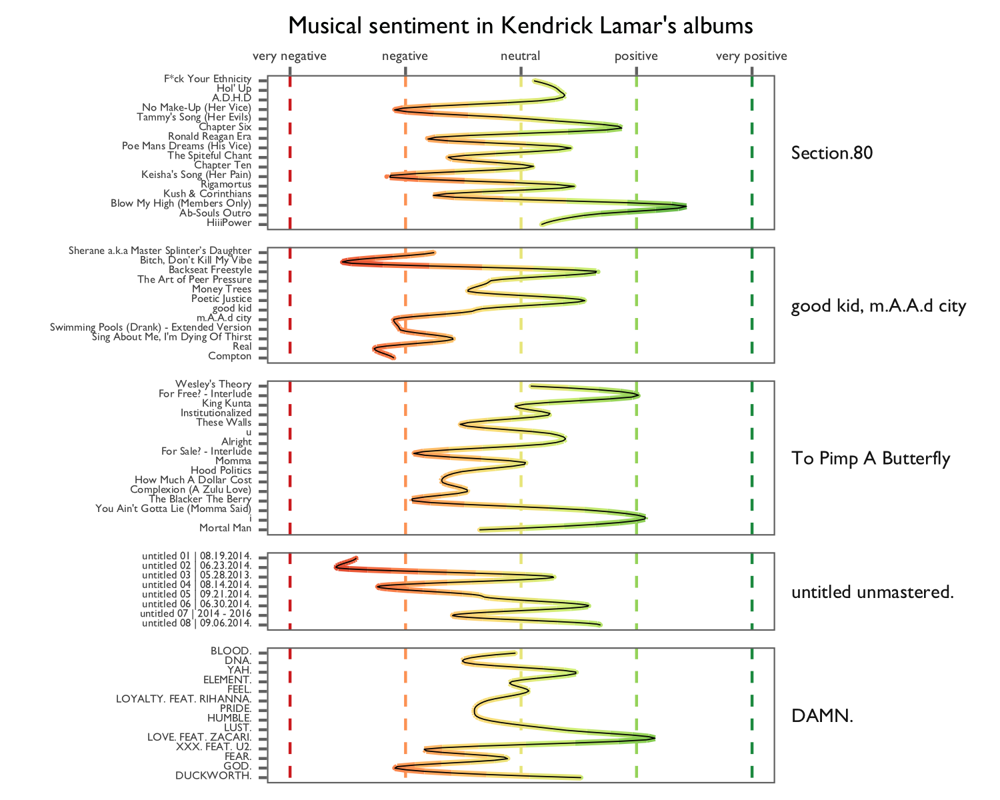
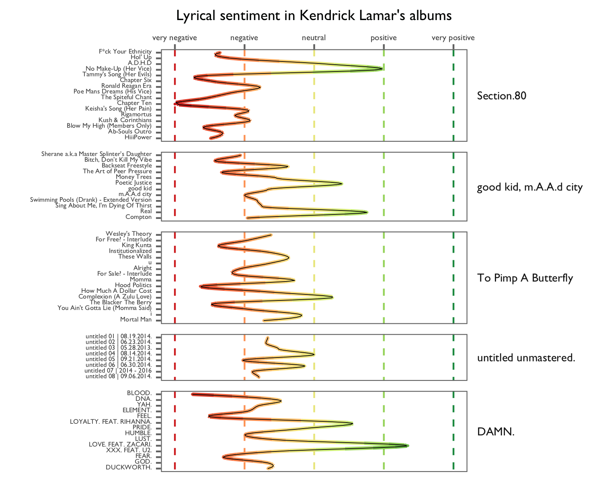
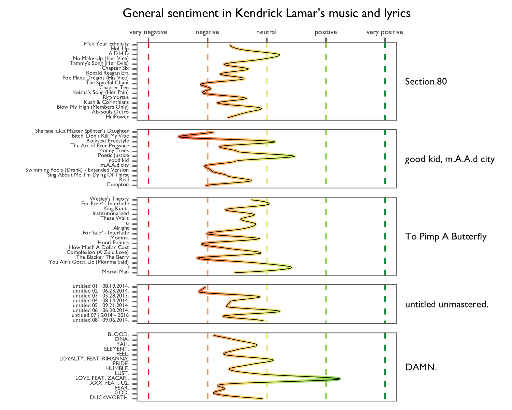
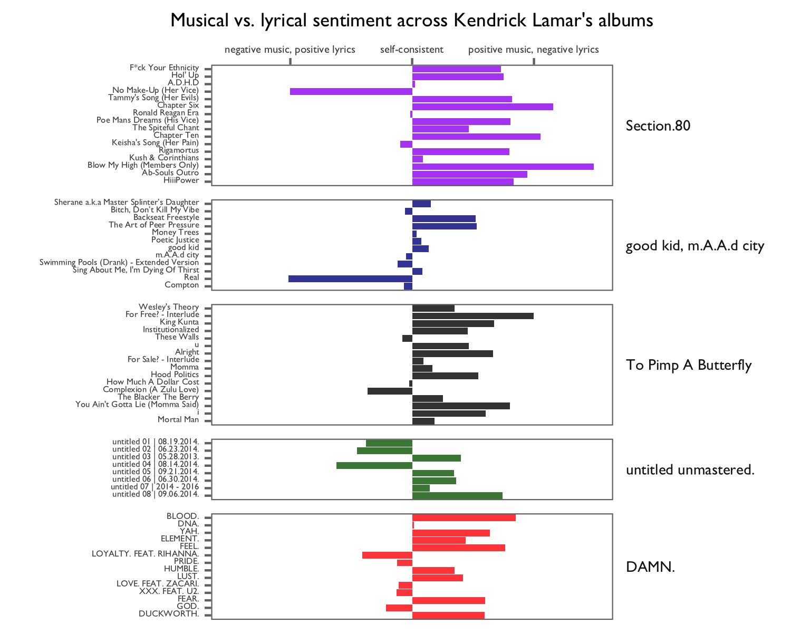
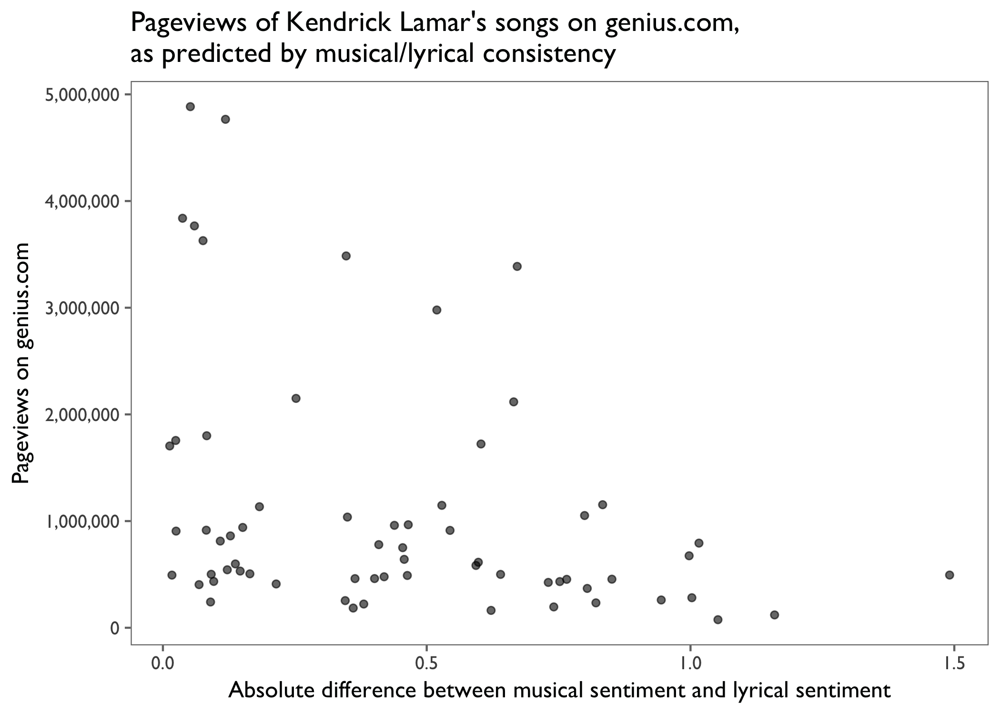
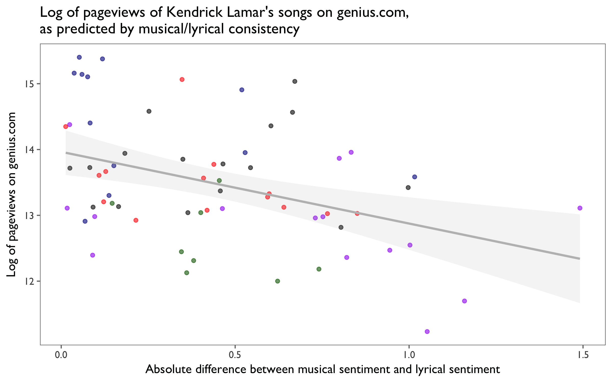

Millions of people are listening to Kendrick Lamar's music, and many are analysing his lyrics too. On [Genius](https://genius.com/artists/Kendrick-lamar), a lyric annotation website, the songs on Kendrick's studio albums have over 70 million pageviews. Many of these songs have dozens of annotations, which are often refined by hundreds of contributors, including the Pulitzer-prize winning author [Michael Chabon](http://pitchfork.com/news/58421-kendrick-lamars-the-blacker-the-berry-gets-annotated-for-genius-by-pulitzer-winning-author-michael-chabon/).

But not too many people are analysing Kendrick's music with hard data, so I decided to give it a shot. A few months ago I read a fantastic data science blog post by RCharlie which tried to pin down [the most depressing Radiohead song](http://rcharlie.com/2017-02-16-fitteR-happieR/), using data from Spotify and Genius. I modified RCharlie's code to get the data on Kendrick's music. If you're interested, my script for scraping the data is [here](https://github.com/laingdk/kendrick/blob/master/src/scrape_kendrick.R), and the data itself is [here](https://github.com/laingdk/kendrick/blob/master/data/scraped_kendrick_data.csv).

I've included most of my code in the post, but if you're not into that, you should be able follow along with the writing and the visualizations alone.

Let's get started! I began by loading the data and fixing some factor levels.

``` r
# Read in the data.
kendrick <- read.csv("../data/kendrick_data.csv")

# Fix the factor levels for the albums.
kendrick$album_name <- factor(kendrick$album_name, levels = c("Overly Dedicated", "Section.80", "good kid, m.A.A.d city", "To Pimp A Butterfly", "untitled unmastered.", "DAMN."))

# Remove Overly Dedicated (because it's technically a mixtape, not a studio album).
kendrick <- kendrick %>% filter(album_name != "Overly Dedicated")

# Fix the factor levels for the tracks.
kendrick$track_name <- factor(kendrick$track_name, levels = as.character(kendrick$track_name))
```

The first thing I wanted to know was which of Kendrick's songs are the most analysed on Genius. One measure of this is the number of annotations for a given song. The only problem is that some songs have fewer lyrics than others, and no lyric can have more than one annotation. So, I used the number of annotations per word:

``` r
# Get the number of annotations per word.
kendrick <- kendrick %>% mutate(ann_per_word = annotations/song_word_count)
```


The data have offered up [For Free? - Interlude](https://genius.com/5047115) as the most analysed Kendrick Lamar song:

<center>
<iframe width="560" height="315" align="middle" src="https://www.youtube.com/embed/_ZTYgq4EoRo" frameborder="0" allowfullscreen>
</iframe>
</center>
<br> I'm pretty satisfied with this answer. The song is dizzyingly complex, both lyrically and musically, and it's chock-full of symbolism, history, and wordplay.

Runners-up are [Rigamortis](https://genius.com/Kendrick-lamar-rigamortus-lyrics) and [HiiiPower](https://genius.com/Kendrick-lamar-hiiipower-lyrics):

<center>
<iframe width="280" height="157" align="middle" src="https://www.youtube.com/embed/sBvngg87998" frameborder="0" allowfullscreen>
</iframe>
<iframe width="280" height="157" align="middle" src="https://www.youtube.com/embed/RT2ZCdPVLAs" frameborder="0" allowfullscreen>
</iframe>
</center>
<br>

The cool part
-------------

I wanted to know how musical and lyrical sentiment vary within and between Kendrick's albums. The first part is easy: Spotify's API provides a variable called "valence", which is defined as follows:

> A measure from 0.0 to 1.0 describing the musical positiveness conveyed by a track. Tracks with high valence sound more positive (e.g. happy, cheerful, euphoric), while tracks with low valence sound more negative (e.g. sad, depressed, angry).

Below is a plot of the valence of Kendrick's music across his studio albums.



Kendrick fans will recognize many of these scores as vaguely correct, but several of them are not. For example, the highest-scoring song was [Blow My High (Members Only)](https://genius.com/Kendrick-lamar-blow-my-high-members-only-lyrics):

<center>
<iframe width="560" height="315" align="middle" src="https://www.youtube.com/embed/n4bm7hqu_GE" frameborder="0" allowfullscreen>
</iframe>
</center>
<br>

While it's by no means a sad or even angry song, it doesn't reach emotional highs anywhere near what you'd expect from the Most Positive Song in Kendrick's career. I think it's fair to say that Spotify's valence variable is incomplete as a measure of overall sentiment. The main thing that is missing is the sentiment in the lyrics alone. I had to compute it myself.

``` r
# Change the text from factor to character.
kendrick$lyrics <- as.character(kendrick$lyrics)

# Get one word per row.
tidy_kendrick <- kendrick %>% unnest_tokens(word, lyrics)

# Remove stop words. (These are words like "the" and "a", which only carry syntactic meaning.)
cleaned_kendrick <- tidy_kendrick %>%
        anti_join(stop_words)

# Get the sentiment of words in the Bing lexicon.
bing <- get_sentiments("bing")

# Get the sentiment across the tracks.
kendrick_sentiment <- cleaned_kendrick %>%
        inner_join(bing) %>%
        count(track_name, sentiment) %>%
        spread(sentiment, n, fill = 0) %>%
        mutate(sentiment = (positive - negative)/(positive + negative))

# Join the sentiment with the original dataset.
kendrick <- inner_join(kendrick, kendrick_sentiment)
```

I joined the lyrics with the Bing lexicon — a list of words which are labelled by humans as positive or negative — and subtracted the negative words from the positive ones to get a general measure of lyrical sentiment. In each song, I normalized the sentiment by dividing by the total number of words that were present in both the song and the Bing lexicon.

Below I plot the lyrical sentiment across albums.



Fans of Kendrick's music will recognize that many of the sentiment scores are in line with expectations. Happy songs like [LOVE. FEAT. ZACARI](https://genius.com/Kendrick-lamar-love-lyrics) and [Poetic Justice](https://genius.com/Kendrick-lamar-poetic-justice-lyrics) have high scores, and darker songs like [FEEL](https://genius.com/Kendrick-lamar-feel-lyrics) and [The Blacker the Berry](https://genius.com/Kendrick-lamar-the-blacker-the-berry-lyrics) have low scores.

But there are some mistakes, too. The main weakness of this measure of lyrical sentiment is that it can't pick up on negation or irony. For example, the song that was identified as having the second-most positive lyrics in Kendrick's whole discography was [No Make-up (Her Vice)](https://genius.com/Kendrick-lamar-no-makeup-her-vice-lyrics):

<center>
<iframe width="560" height="315" align="middle" src="https://www.youtube.com/embed/xQtWY-ZxFTw" frameborder="0" allowfullscreen>
</iframe>
</center>
<br>

Despite its eerie melody and tragic story (revealed in the final line), the song got a high sentiment score because of the many positive words in the chorus:

> I **love** the way you put it on your eyes
>
> The **roses** on your face **light** up the sky
>
> Those lips are **colorful** all of the time
>
> And girl, that's fine, but I wanna know do you mind
>
> No make-up today, no make-up today

The verses also repeat the words, "beautiful," "beauty," "wonderful blessing," "heaven," and "smile." This song is also unique in that it completely lacks profanity, which would usually contribute to the negativity of the lyric sentiment.

That's another problem with this measure: in hip-hop, profanity isn't always intended to be negative. And Kendrick is very profane. If you're up for it, and over the age of 18, you can see a word cloud of his most used words [here](https://github.com/laingdk/kendrick/blob/master/results/kendrick_wordcloud.png).

Still, my measure of lyrical sentiment usually captures the general mood of the lyrics. So, to get a more complete measure of the sentiment of each song, I converted the musical and lyrical sentiment scores to the same scale, then took the average between them.

``` r
# Transform the valence to the same scale as the sentiment.
kendrick <- kendrick %>% mutate(valence = ((valence*2)-1))

# Get a smarter measure of sentiment
kendrick <- kendrick %>% mutate(smart_sentiment = (sentiment + valence)/2)
```

I think the resulting plot gives the best generalization of musical and lyrical sentiment:



Proclamations about extreme positivity and negativity are now more rare, and I think they're more accurate. Here are the five most negative songs in Kendrick's discography:

``` r
kendrick %>%
        select(track_name, smart_sentiment) %>%
        arrange(smart_sentiment) %>% head(5) %>% kable()
```


| track\_name               |  smart\_sentiment|
|:--------------------------|-----------------:|
| Bitch, Don’t Kill My Vibe |        -0.7441429|
| The Blacker The Berry     |        -0.5881429|
| untitled 02 &#124; 06.23.2014. |        -0.5741694|
| The Spiteful Chant        |        -0.5496250|
| Hood Politics             |        -0.5460909|


And here are the top five most positive songs:

``` r
kendrick %>%
        select(track_name, smart_sentiment) %>%
        arrange(desc(smart_sentiment)) %>% head(5) %>% kable()
```


| track\_name               |  smart\_sentiment|
|:--------------------------|-----------------:|
| LOVE. FEAT. ZACARI.       |         0.6183636|
| Poetic Justice            |         0.2380000|
| i                         |         0.2105455|
| untitled 06 &#124; 06.30.2014. |         0.1136667|
| A.D.H.D                   |         0.1058750|


Listen to any of these songs, and I think you'll at least agree with their classification as positive or negative, if not their rankings.

The even cooler part
--------------------

Now here's where things get interesting. I wanted to know which songs had the greatest *differences* between their musical sentiment and their lyrical sentiment. For example, I wanted to know which songs sound happy but have sad lyrics, or vice versa. I was also curious to know which songs had the *least* differences between musical and lyrical sentiment; these would be the most self-consistent, the least ironic. For each song, I took the absolute value of the difference between the two measures of sentiment:

``` r
# Get a measure of the difference between lyric sentiment and song valence.
# This tells us which songs sound positive but are filled with especially negative
# lyrics, or vice versa.
kendrick <- kendrick %>% mutate(sent_val_dif = abs(valence - sentiment))
```

With a little bit of trickery for the purposes of visualization (`sent_val_dif*sign(valence - sentiment)`), we can see which songs are especially consistent or especially inconsistent in one direction or the other:



No Make-up was identified as being especially inconsistent in its sound and lyrics, as predicted. Another sad song with seemingly positive lyrics is [Real](https://genius.com/Kendrick-lamar-real-lyrics), in which Kendrick uses the word "love" 49 times:

<center>
<iframe width="560" height="315" align="middle" src="https://www.youtube.com/embed/DDau48PysuU" frameborder="0" allowfullscreen>
</iframe>
</center>
<br> So, the combined sentiment score successfully corrected the mistakes made by the lyric sentiment score. I think it was equally successful in correcting for the mistakes in Spotify's measure of musical valence. For example, on the right side of the graph, we can see that "Blow My High (Members Only)" was identified as being the song with the greatest positive difference between musical sentiment and lyrical sentiment.

The other interesting feature of the plot above is the songs that are the most self-consistent — the ones with the least differences between musical sentiment and lyrical sentiment. If you're a Kendrick fan and you scan through the songs with the smallest bars, you might notice something interesting: most of them are quite popular even among people who don't listen to Kendrick's albums. Could it be that songs with emotionally consistent lyrics and sounds are more likely to be hits?

The still cooler part
---------------------

I tried plotting the number of pageviews on Genius against the absolute difference between musical and lyrical sentiment.



On the left side of the graph, you see songs with small differences between musical and lyrical sentiment — the self-consistent songs. On the right side, you see songs with large differences — the positive songs with negative lyrics, and vice versa. The y-axis is the number of pageviews on Genius, which I think is a decent measure of popularity. (To visit a song's page, not only would somebody usually have to know the song, but they would usually like it enough to wonder what the lyrics mean.)

This looked like a pretty strong pattern to me, but if I was going to do a fair test of my hypothesis, I realized that I should log-transform the pageviews to get more consistent dispersion. (If you click the plot, you can see an interactive version to find out which song is which.)

[](https://laingdk.shinyapps.io/kendrick_pageview_plot/){:target="_blank"}

It still looked to me like I had found a clear pattern, so I tried fitting a linear model to see if there is a statistically significant effect. I controlled for the album, which is important for two main reasons. Firstly, some albums have better reputations than others, which could draw in additional pageviews for a given song. Secondly, some albums are older than others, which means those pages have had more time to gather pageviews. So, controlling for the album controls for both the reputation of a given cluster of songs and their time period. For the stats geeks, here are the results of my model:

``` r
fit <- lm(log(pageviews) ~ sent_val_dif + album_name, kendrick)
summary(fit)
```

    ## 
    ## Call:
    ## lm(formula = log(pageviews) ~ sent_val_dif + album_name, data = kendrick)
    ## 
    ## Residuals:
    ##     Min      1Q  Median      3Q     Max 
    ## -1.6085 -0.3683 -0.1066  0.5902  1.5288 
    ## 
    ## Coefficients:
    ##                                  Estimate Std. Error t value Pr(>|t|)    
    ## (Intercept)                       13.2912     0.2619  50.743  < 2e-16 ***
    ## sent_val_dif                      -0.6049     0.2791  -2.168  0.03423 *  
    ## album_namegood kid, m.A.A.d city   1.2689     0.2962   4.284 6.87e-05 ***
    ## album_nameTo Pimp A Butterfly      0.7250     0.2600   2.789  0.00711 ** 
    ## album_nameuntitled unmastered.    -0.4272     0.3117  -1.371  0.17570    
    ## album_nameDAMN.                    0.4542     0.2694   1.686  0.09708 .  
    ## ---
    ## Signif. codes:  0 '***' 0.001 '**' 0.01 '*' 0.05 '.' 0.1 ' ' 1
    ## 
    ## Residual standard error: 0.6934 on 59 degrees of freedom
    ##   (1 observation deleted due to missingness)
    ## Multiple R-squared:  0.4751, Adjusted R-squared:  0.4306 
    ## F-statistic: 10.68 on 5 and 59 DF,  p-value: 2.448e-07

I found that the absolute difference between lyrical sentiment and musical sentiment was predictive of pageviews, even when controlling for the album. I think this is pretty cool. Emotional consistency between sounds and lyrics is predictive of a song's popularity. It would be interesting to see whether this effect persists into the future, as more people discover Kendrick Lamar and analyse the lyrics across his discography. It would also be interesting to see whether the effect generalizes to other artists.

I'll now say a few words on the relative merits of each album, based on my own experience and my understanding of the data. Many critics believe that *To Pimp A Butterfly* is the best album of the decade so far — potentially even the best album of the century. While I agree that *To Pimp A Butterfly* is a masterpiece, I think that in thirty years, *good kid, m.A.A.d city* will seem like the better album. I think it's more internally consistent than the other albums, which we can partly see in the fact that most of its songs have small differences between musical and lyrical sentiment. It is also sublime in its imagery, its narrative, and its evocation of eduring themes in male teenhood. This shows up in the data too!

To get a brief glimpse of the themes across Kendrick's albums, I computed something called the Term Frequency-Inverse Document Frequency, of tf-idf, of each word in the album. The tf-idf is the product of two numbers:

-   The *term frequency*: the frequency at which a word appears in a given song.
-   The *inverse document frequency*: the frequency at which that word appears across all songs. (It's the proportion of songs which contain the word at least once.)

So, tf-idf tells us which words appear frequently in some songs but not so much in others. If a word is barely used in any of the songs, then it will have a low tf-idf. Similarly, if a word shows up in *many* of the songs, then it will have a low tf-idf. What counts is whether it shows up consistently in one set of documents but not all the others. Here is how the tf-idf is computed:

``` r
# Get the word counts for each album.
album_word_counts <- kendrick %>% group_by(album_name) %>% summarise(word_count = sum(song_word_count))

# Get the word counts for each track.
word_counts <- tidy_kendrick %>%
        select(album_name, track_number, track_name, word) %>% 
        anti_join(stop_words) %>%
        count(album_name, track_number, track_name, word, sort = TRUE) %>% 
        ungroup() %>% 
        left_join(album_word_counts)

# Get the tf-idf
album_words <- word_counts %>%
        bind_tf_idf(word, album_name, n)

# Look at the words with the highest tf-idf within good kid, m.A.A.d city.
album_words %>%
        filter(album_name == "good kid, m.A.A.d city") %>%
        select(-word_count) %>%
        arrange(desc(tf_idf)) %>% 
        head() %>% select(album_name, track_name, word, tf_idf) %>% kable()
```


| album\_name            | track\_name                               | word   |    tf\_idf|
|:-----------------------|:------------------------------------------|:-------|----------:|
| good kid, m.A.A.d city | Sing About Me, I'm Dying Of Thirst        | thirst |  0.0066223|
| good kid, m.A.A.d city | Swimming Pools (Drank) - Extended Version | drank  |  0.0051237|
| good kid, m.A.A.d city | Poetic Justice                            | poetic |  0.0049668|
| good kid, m.A.A.d city | Swimming Pools (Drank) - Extended Version | dive   |  0.0049668|
| good kid, m.A.A.d city | The Art of Peer Pressure                  | doo    |  0.0037251|
| good kid, m.A.A.d city | Money Trees                               | bish   |  0.0035529|


``` r
# Reset the factor levels according to the tf-idf
plot_albums <- album_words %>%
        arrange(desc(tf_idf)) %>%
        mutate(word = factor(word, levels = rev(unique(word))))
```

Below you can see the words with the highest tf-idf for each album:


I think all these word clouds are pretty cool, but the one for *good kid, m.A.A.d city* is especially rich with evocative words.

There is surely more to be done with this data. I haven't even touched the many other variables from Spotify's API, including "danceability," "energy," "key," "loudness," "speechiness," "acousticness," "instrumentalness," "tempo," and "time\_signature." Again, you can download the data [here](https://github.com/laingdk/kendrick/blob/master/data/scraped_kendrick_data.csv). Let me know if you find something cool!
