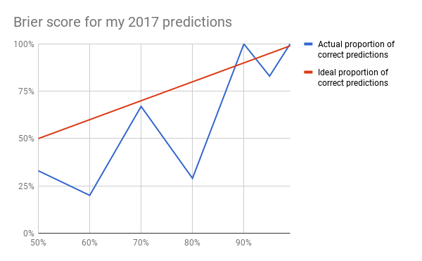

A year ago I made several predictions for things that would happen in 2017. Those predictions, and their corresponding outcomes, are listed below.

### World

Global poverty rates will be lower at the end of the year than they currently are: 99%

* [True](http://worldpoverty.io/).

Donald Trump won't be assassinated: 99%

* True.

Donald Trump won't be impeached: 90%

* True.

There will be no use of nuclear weaponry: 95%

* True.

Brexit won't happen by the end of the year: 95%

* True.

Political polarization in the United States will remain near its current levels: 95%

* True. I should have specified a metric for polarization in 2016. But [between 2015 and 2017, polarization has risen](http://www.people-press.org/interactives/political-polarization-1994-2017/). It doesn't look like it's risen so much that I would interpret my statement last year as false, so I'm saying this is true.

Hillary Clinton won't face charges: 90%

* True.

The top three grossing movies will all be sequels or remakes: 90%

* True. (Star Wars, Guardians of the Galaxy, and Beauty and the Beast)

...top five grossing movies: 70%

* True. (plus Despicable Me 3 and The Fate of the Furious)
	* In fact, it turns out that the top 14 movies were sequels or remakes. The top-grossing movie that wasn't a sequel or a remake was Dunkirk.

The death count in the Philippine Drug War will be higher in 2017 than it was in 2016 (6239 fatalities): 80%

* False. I should have noted where I got that number, because I can't remember now. The official Phillippine claim is that there have been 3,967 deaths total. A Phillippine former education secretary claims there have been over 13,000. If the latter number is correct, and my original source from last year was correct, then my prediction is correct. But I don't really trust either source, and I think a poorly specified prediction is a wrong one.

There will be no AI-related headlines that seem bigger than the AlphaGo win: 80%

* [False.](https://deepmind.com/blog/alphago-zero-learning-scratch/)

Justin Trudeau's approval ratings will be below 65% by the end of the year: 80%

* [True.](http://www.cbc.ca/news2/interactives/leadermeter/index.html) But I should have said according to which source. CBC seems like a reasonable one.

...but above 50%: 80%

* [False.](http://www.cbc.ca/news2/interactives/leadermeter/index.html)

More than 15 million VR headsets will be sold: 80%

* [False.](https://techcrunch.com/2017/08/26/this-vr-cycle-is-dead/) Hard to find good data, but it seems like I was wrong.

The war in Syria will not be over by the end of the year: 70%

* True.

Donald Trump will meet with Vladimir Putin in the first 100 days of his presidency: 60%

* False.

Global nuclear weapons stockpiles will be higher by the end of 2017 than they are currently (~10,000 stockpiled warheads): 60%

* [False.](https://fas.org/issues/nuclear-weapons/status-world-nuclear-forces/) I should have noted where I got that number, but it seems like the number is still going down.

Kevin O'Leary will be the next leader of the Conservative Party of Canada: 60%

* [False.](https://en.wikipedia.org/wiki/Conservative_Party_of_Canada_leadership_election,_2017)

Construction on the border wall will not begin in 2017: 60%

* True, [but I should have specified what I meant by "begin"](http://metro.co.uk/2017/12/07/people-try-scale-trumps-border-wall-official-security-tests-begin-7140146/). (The fact that prototypes exist doesn't mean that a wall will be built.)

Trump will not withdraw from the Paris Agreement in 2017: 60%

* False.

Angela Merkel will be re-elected: 50%

* True.

At least one more country will vote to leave the EU: 50%

* False.

### Personal

I will post on my blog at least 12 times: 99%

* True.

I will tweet more in 2017 than I did in 2016: 99%

* True.

I will still be at least a vegetarian at the end of the year: 99%

* True.

...and I will be fully vegan: 50%

* False, but I eat far less eggs and cheese that I used to.

I'll give a Green College member series talk on existential risk: 95%

* True.

I'll still be using Anki regularly at the end of the year: 95%

* False, but if I ever take a class again, I absolutely plan to use it.

I'll still be using an RSS feed at the end of the year: 95%

* True, but not as frequently as I expected.

I'll still be using Habitica regularly at the end of the year: 90%

* True, but not as regularly as I expected.

My core beliefs and values won't shift in any major ways: 90%

* True.

My next full-time job will pay better than any job I've had before: 90%

* True.

I will be employed within three months of graduating: 80%

* True.

I will read at least two books whose thesis I currently disagree with: 80%

* False.

I will travel outside of Canada this year: 70%

* False.

One of my close friends or family members will become vegetarian: 50%

* False.

## Brier score

On balance, it's better to be more often correct about your confident predictions than your tentative predictions. The [Brier score](https://en.wikipedia.org/wiki/Brier_score) is a measure of my calibration. A perfect score means that 99% of the time I make a prediction with 99% confidence, I turn out to be right. And 50% of the time I make a prediction with 50% confidence, I turn out to be right. Et cetera. How is my score this year?

* 99% predictions: 5/5 correct – 100%
* 95% predictions: 5/6 correct – 83%
* 90% predictions: 6/6 correct – 100%
* 80% predictions: 2/7 correct – 29%
* 70% predictions: 2/3 correct – 67%
* 60% predictions: 1/5 correct – 20%
* 50% predictions: 1/3 correct – 33%

Not great!

Formally the Brier score is the mean squared error of all my forecasts:

$$BS = \frac{1}{N}\sum\limits _{t=1}^{N}(f_t-o_t)^2 \,\!$$

where *f_t* is the probability that was forecast, *o_t* is the outcome of the event at instance *t* (0 if it doesn't happen and 1 if it does) and *N* is the number of forecasting instances.

$$5*((0.99-1)^2) = 0.0005$$

$$5*((0.95-1)^2) = 0.0125$$

$$1*((0.95-0)^2) = 0.9025$$

$$6*((0.90-1)^2) = 0.06$$

$$2*((0.80-1)^2) = 0.08$$

$$5*((0.80-0)^2) = 3.2$$

$$2*((0.70-1)^2) = 0.18$$

$$1*((0.70-0)^2) = 0.49$$

$$1*((0.60-1)^2) = 0.16$$

$$4*((0.60-0)^2) = 0.64$$

$$1*((0.50-1)^2) = 0.25$$

$$2*((0.50-0)^2) = 0.5$$

$$\frac{0.0005+ 0.0125+ 0.9025+ 0.06+ 0.08+ 3.2+ 0.18+ 0.49+ 0.16+ 0.64+ 0.25+ 0.5}{35 \text{ forecasts}}$$

$$= 0.185$$

What does this mean? Let's graph my percentage of correct predictions across all confidence levels.

My Brier score – 0.185 – is the average squared distance between the blue line and the red line.

Let's be frank: my calibration is not very good! While I was generally well calibrated for my very confident predictions, I was pretty dismally off the mark for my predictions at 80% and under. Specifically, I was [overconfident](https://en.wikipedia.org/wiki/Overconfidence_effect). Of my seven predictions at 80% confidence, I only got two correct. Of my five predictions at 60% confidence, I only got one correct. My calibration at 70% confidence was decent, but only for three predictions total, so I may have just been lucky.

In a few days I'll make some predictions for 2018. Having reflected on my predictions from last year, I'll try to keep the following in mind:

* For numeric predictions, I need to specify which sources I'll be using to determine outcomes at the end of the year.
* I should try to make more predictions in general, ideally at all confidence levels.
* For my less confident predictions, I should consider framing them negatively. My rationale here is that if my default is to think that an uncertain event might occur, I'm probably imagining that event vividly, which will cause me to put the probability at over 50% when in fact it should be less than that. For example, last year I predicted that Trump would meet with Putin in the first 100 days of his presidency. That's a vivid event – easy to imagine, and seems consistent with my impression that Trump likes Putin. But if I were to adopt the heuristic that vivid outcomes are always less likely than they seem, I might have changed my prediction to something like, "Trump will not meet with Putin in the first 100 days of his presidency. (60%)" This approach would retain my uncertainty about the event, but it would help me guard against overestimating the probability of vivid outcomes.